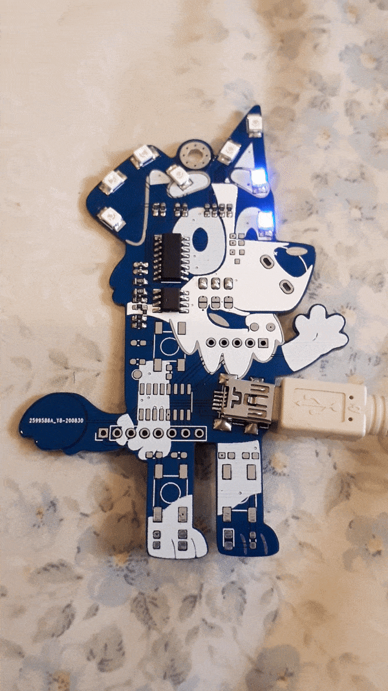
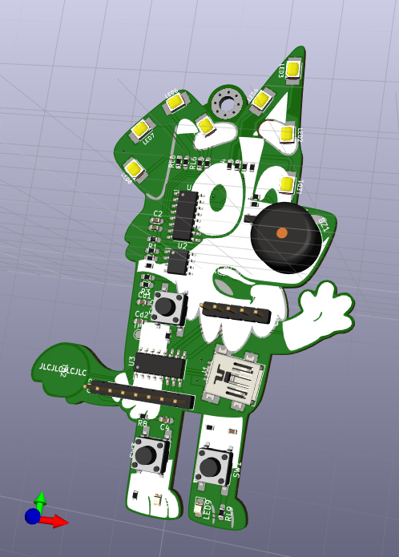
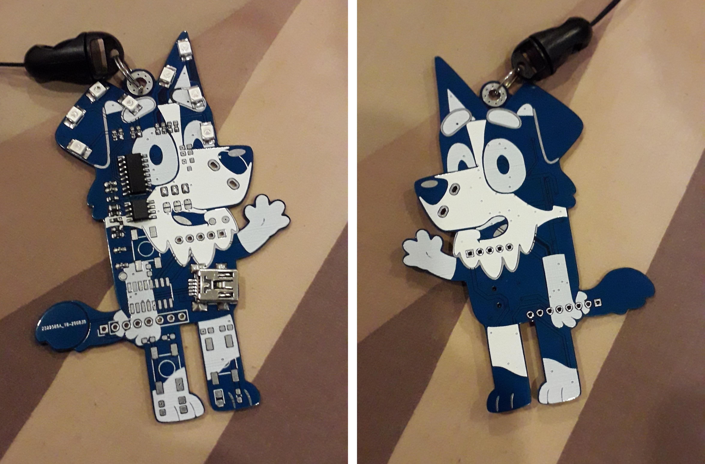
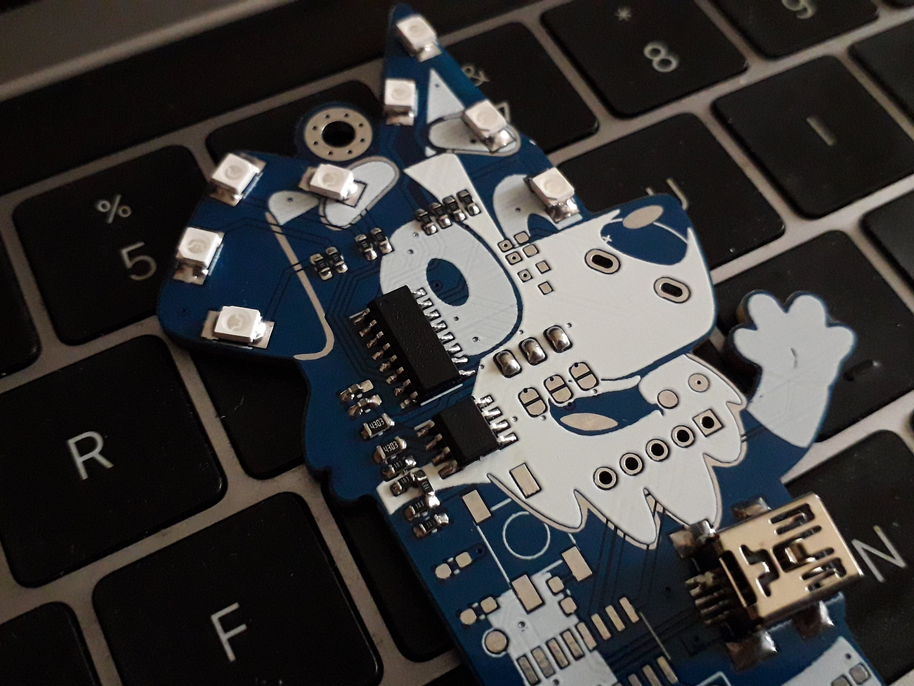

# Bluey PCB Badge

## Description

This is a PCB badge artwork which is based on the Bluey Cartoon TV show. The PCB can be used as a keychain or on a lanyard.

I designed this because I wanted to make a nice gift for any occasion.

3D render mockup

## Gerbers

You can find the gerber files [here](./gerbers).

I sent the PCB gerber files to ***[jlcpcb.com](https://jlcpcb.com/)*** for manufacturing and this is how it looks like.

## Circuit design

The schematic is [located here](Schematic.pdf). The circuit has the following 2 configurations.

#### LED Chaser

The LED chaser circuit only requires soldering an LM358 opamp and a 74HC595 shift register. The LEDs will run continuously.

This is to make a low-cost gift to friends as the total cost including the PCB shipping and components is around SGD2.50  per piece

#### Microcontroller

The second configuration includes a CH552 microcontroller, the 74HC595 shift register and a buzzer. 

This is meant for special occasions because the microcontroller can play different music like a "Happy Birthday" song. The total cost is slightly higher at SGD10 per piece.
